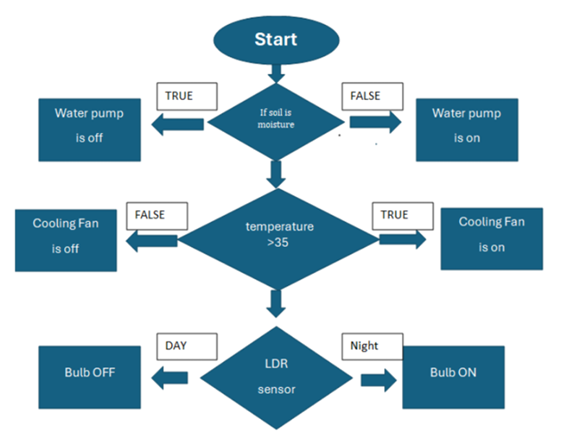
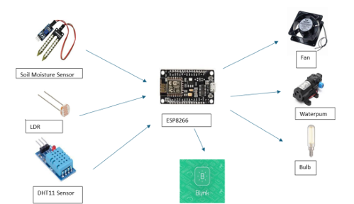
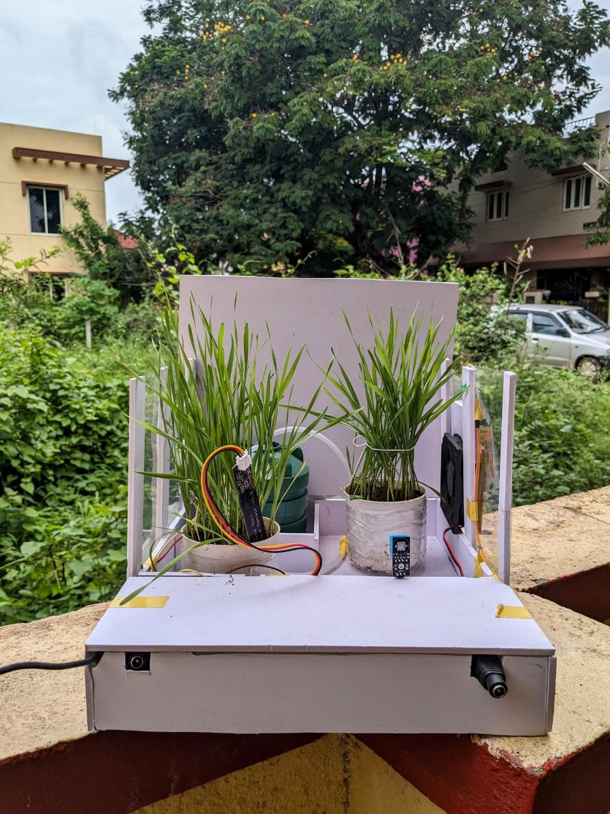
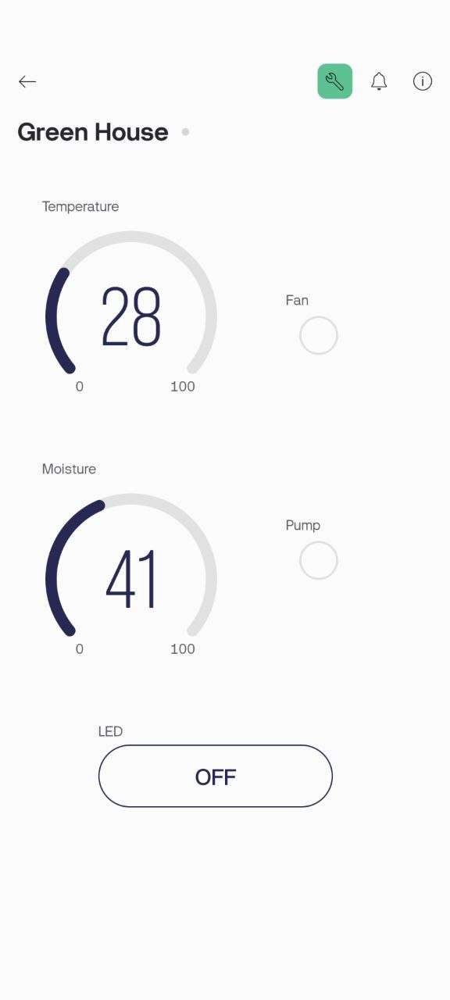

# Greenhouse Monitoring System

## Introduction
The Greenhouse Monitoring System is an IoT-based project aimed at providing real-time monitoring and control of environmental factors essential for healthy plant growth in greenhouses. This system includes sensors for temperature, humidity, rain, moisture, cooling, and light, which send data to a central platform accessible remotely via the Blynk app.

## Motivation
The project is motivated by the need to enhance efficiency and productivity in greenhouse management using IoT technology, overcoming the limitations of traditional manual systems.

## Objectives
1. Develop an IoT-based monitoring system to continuously track environmental parameters.
2. Design automated control mechanisms to adjust environmental factors as needed.
3. Enhance resource efficiency by optimizing irrigation schedules and regulating heating and cooling systems.

## System Design
### Functional Block Diagram

### System Architecture

### Hardwares Used
- **ESP8266 Module**
- **Relay Module**
- **Soil Moisture Sensor**
- **DHT11 Sensor**
- **Water Pump**
- **LDR Sensor**
- **Cooling Fan**
  
## Final Model
### Photo of the Final Model

### Blynk App Interface

## Conclusion
The Greenhouse Monitoring System successfully provides real-time monitoring and control of environmental factors, enhancing crop yield and resource efficiency. The integration of IoT technology allows for more precise and automated greenhouse management, reducing the need for manual intervention and improving overall efficiency.

  
